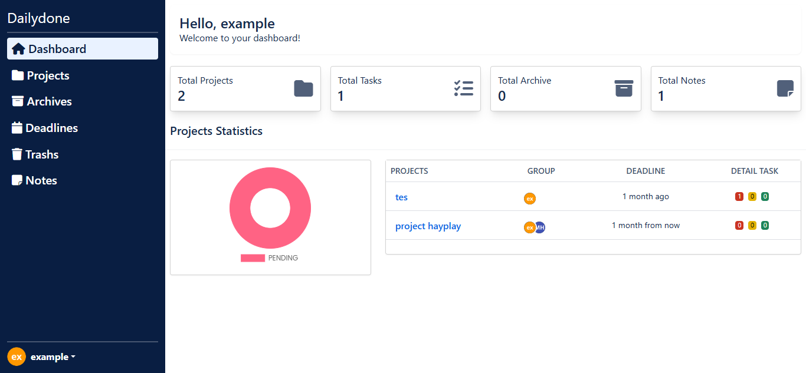
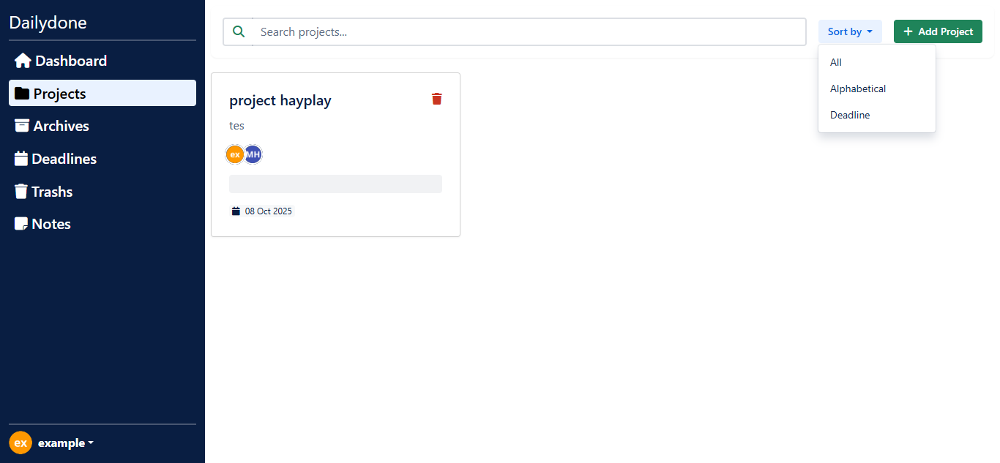
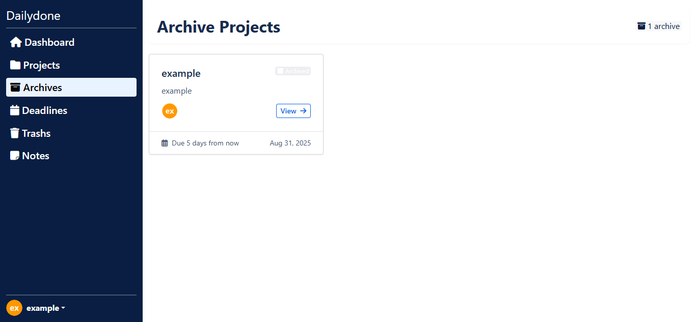
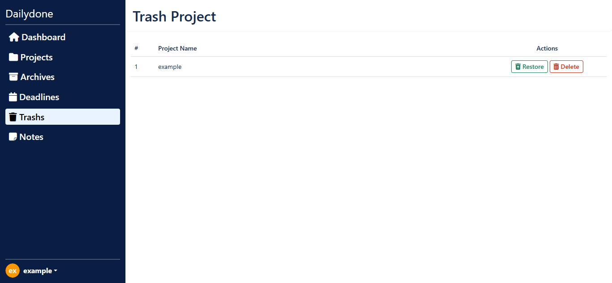
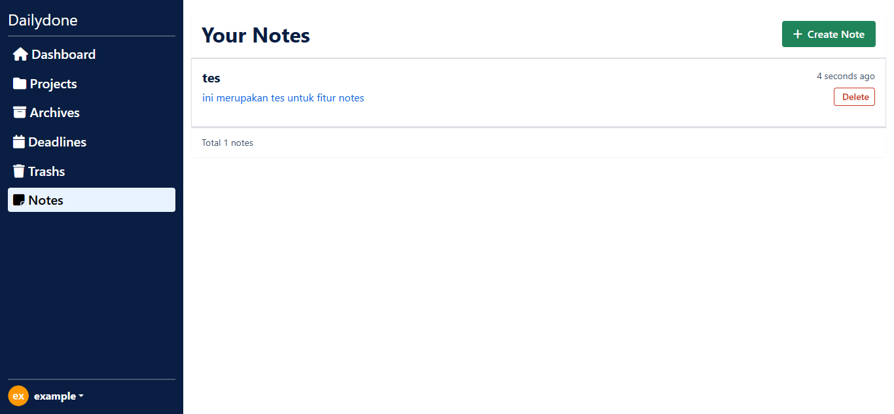

# Dailydone

Dailydone is a task management platform with the following features: Team collaboration, collaboration via links or email, and chat with task owners.

# Tech Stack Dailydone

**PHP:** Programming language for server-side logic.

**Laravel:** PHP framework for web application development.

**Chatify:** Laravel library for chat features in Dailydone

**Bootstrap:** CSS framework to enhance the appearance of Dailydone.

**FullCalendar:** Library from JavaScript for project deadline features created by project owners on Dailydone.

**Sortable:** JavaScript library for drag and drop tasks in a project to make it easier to change task status.

**TinyMCE:** A rich text editor that allows users to create formatted content in an easy-to-use interface.

**Visual Studio Code:** Text editor used for development.

**MySql:** Database used for local development and testing.

# Screenshots

## Start Page

## Dashboard

## Projects

## Archives Project

## Trashs Project

## Notes

